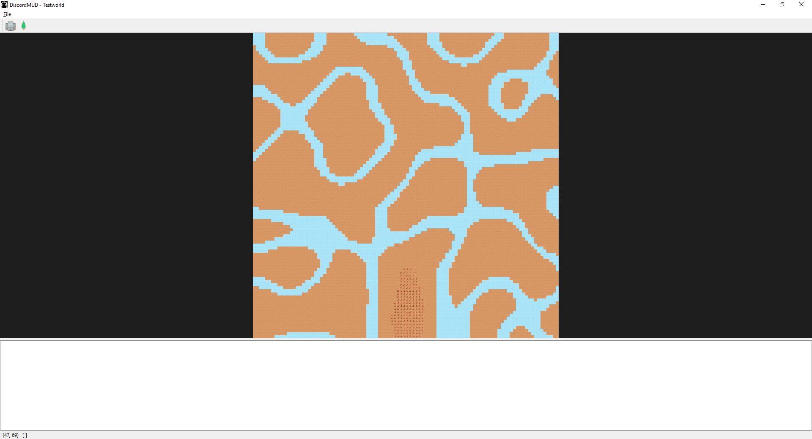

# DiscordMud
MUD game and server that uses discord as a player interface

# Installation
Requires `discord.py`.

In order to run, you must set up and configure your own user bot. More info can be found 
[here](https://github.com/reactiflux/discord-irc/wiki/Creating-a-discord-bot-&-getting-a-token). 

Once you get a token, create a new environmental variable called `DISCORD_BOT_TOKEN`, and set it to be your token. 

Then, run `main.py`. Your bot should log in, and a world creation dialog should appear. Currently, the dialog only asks
for a world name and grid size. 

# Getting started
When you are done, some randomly generated terrain should appear. 

Once your world is created, you need to add a starting town. Click on the 
button to enter `Add Town` mode. Click on a location on the grid to add your first town. A dialog will pop-up asking you 
for some more parameters.

Now it is time to create a character. The prefix for the bot is `*` by default. In a valid chat channel, type 
`*register`. The bot will ask you if you want to join the server. Type `yes`. The bot will then prompt you to name your
 character. Once you have given your character a name, you should see it spawn on top of the starting town in the GUI. 

# Player Controls

* `register`
    * Create a new player character and spawn into the game world.
* `whereami`
    * Get your grid location, and a picture of your surroundings, as far as your `FOV` can see.
* `whoami`
    * Prints your "character sheet" in chat. Contains player name and equipment.
* `go` [`n`, `e`, `s`, `w`]
    * Move your player character in the direction specified. 
* `inventory`
    * Displays a list of the items in the players inventory
    * `equip` [`index`]
        * Have your PC equip the item from your inventory with the specified index. 
    * `unequip` [`index`]
        * Remove the item from your equipment and put it back into your inventory.
* `attack` <`n`, `e`, `s`, `w`, `ne`, `se`, `sw`, `nw`>
    * Attack another player with your currently equipped weapon. If no `direction` is specified, the user will attack
    in the current position only. Otherwise, ranged weapons go in a single direction like a "beam", until they either a)
    hit another player and apply damage, or b) Miss, as the damage falloff, as each tile the projectile traverses 
    removes % damage until it goes to 0. 
* `town`
    * Calling `town` with no parameters is a debug command to check if you're inside a town or not.
    * `inn`
        * Run the events of the town's inn. Usually restores health/resources. 
    * `build` [`base`]
        * `base`
            * Build a personal base on an unoccupied square. Use this for health/ammo resupply. (Note: Currently does not
            require any resources to build; will change to be much more expensive in the future.)
    * `store`
        * Lists all the items (Name, Price, Quantity) in the Town's store. 
        * `buy` [`index`]
            * Purchase the item at the given index, adding it to your inventory.
        * `sell`
            * Sell an item from your inventory, removing it and giving you some money. 

