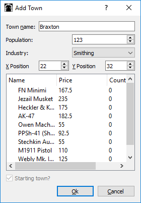

# DiscordMud
MUD game and server that uses discord as a player interface

# Installation
Requires `discord.py`.

In order to run, you must set up and configure your own user bot. More info can be found 
[here](https://github.com/reactiflux/discord-irc/wiki/Creating-a-discord-bot-&-getting-a-token). 

Once you get a token, create a new environmental variable called `DISCORD_BOT_TOKEN`, and set it to be your token. 

Then, run `main.py`. Your bot should log in, and a world creation dialog should appear. Currently, the dialog only asks
for a world name and grid size. 

# Getting started
When you are done, some randomly generated terrain should appear. 

Once your world is created, you need to add a starting town. Click on the 
button to enter `Add Town` mode. Click on a location on the grid to add your first town. A dialog will pop-up asking you 
for some more parameters.

Now it is time to create a character. The prefix for the bot is `*` by default. In a valid chat channel, type 
`*register`. The bot will ask you if you want to join the server. Type `yes`. The bot will then prompt you to name your
 character. Once you have given your character a name, you should see it spawn on top of the starting town in the GUI. 

You can now move your character around by entering `*go`, then `n`, `e`, `s`, `w`, into chat. 

